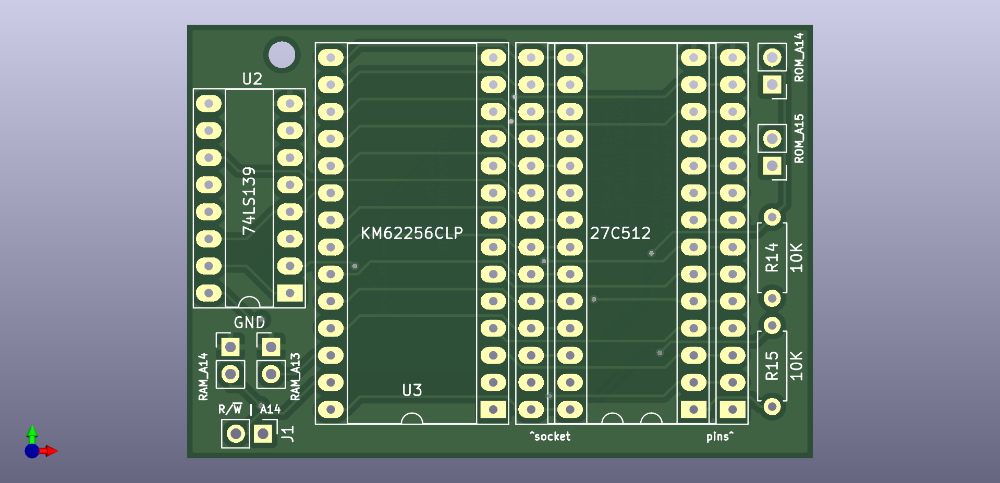
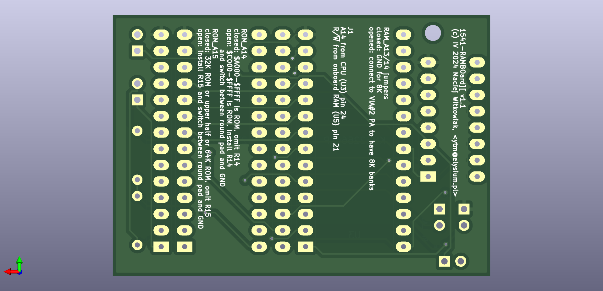
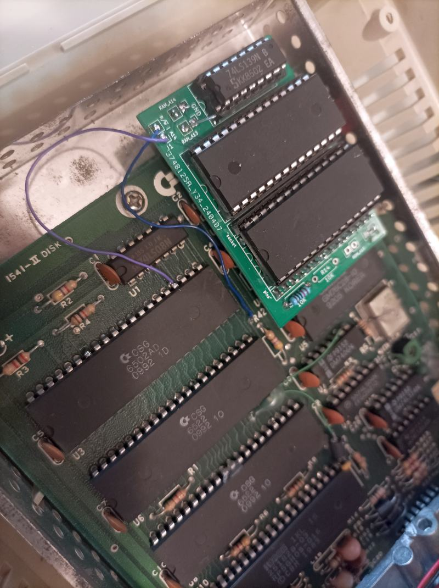
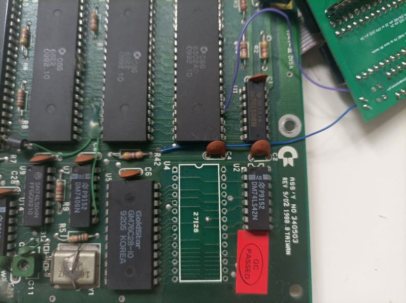
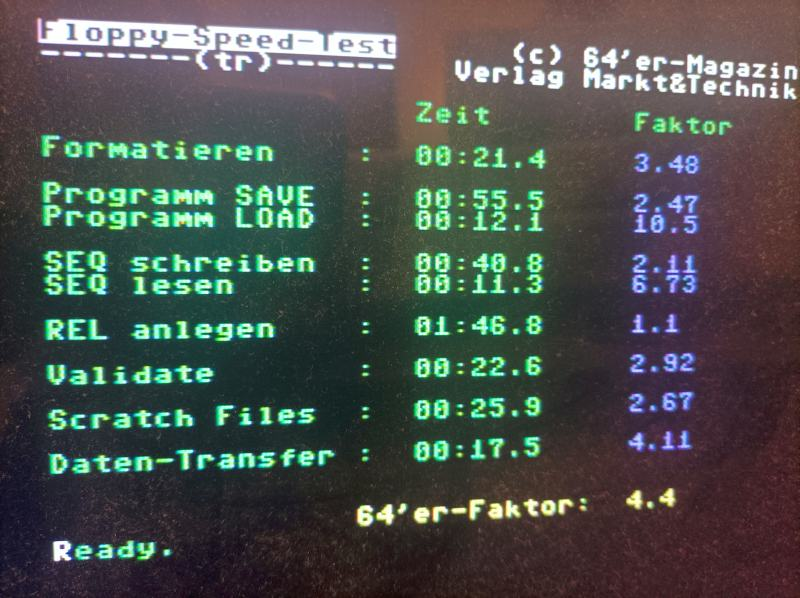
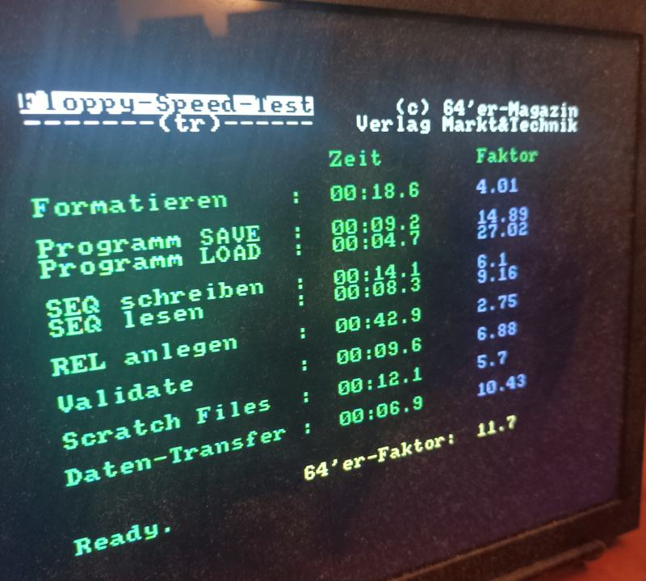

# 1541-RAMBOard][

This is a recreation of [CLD RAMBoard](http://d81.de/CLD-RAMBOard/RAMBOard-2C.shtml) aimed at 1541-II drive with important change: 24K(32K) ROM support. It can be also configured to switch between two banks of 24K(32K) ROMs out of 64K ROM chip or one of four 16K banks.

It supports the following software:

- DolphinDOS2 using much fewer components than [original circuit](https://e4aws.silverdr.com/projects/dolphindos2/rev4/)
- software that needs extra 8K of RAM, such as Maverick
- patches for CBM DOS / JiffyDOS / SpeedDOS use extra ROM space to implement faster GCR decoding procedures from 1571 ROM
- patches also utilize drive RAM expansion to cache the current track

Note that for DolphinDOS 2 and SpeedDOS you need a [parallel connection](https://sta.c64.org/cbmpar41c.html) to C64/128 user port. Since the hardware side is the same, if you have no other reason to stick with SpeedDOS you should really go with DolphinDOS 2.



# Background

After completing [1571 RAM expansion](https://github.com/ytmytm/c128-bytewide-color-ram-1571cr-expansion) and providing [firmware patches for 1571](https://github.com/ytmytm/1571-TrackCacheROM) I turned my eyes to my two 1541-II drives, both already equipped with parallel cable, used in the past for [quick disk to disk copying](https://github.com/ytmytm/c64-ddbb).

I have checked out the [RAMBoard](http://d81.de/CLD-RAMBOard/RAMBOard-2C.shtml) but I wanted to use extra RAM as track cache and in original 1541 firmware there is just no space to put my patches. I would have to remove support for something, e.g. REL files.
So instead I redesigned the circuit to make it work in the following way:

- range `$8000-$9FFF` is RAM (8K)
- range `$A000-$BFFF` is ROM (8K)
- range `$C000-$FFFF` is ROM (16K)

This new 8K of ROM is the reason why from 32K ROM chip only 24K are visible for CPU - the first 8K being covered by RAM expansion.

I have spend few weeks working on original DOS code, JiffyDOS and SpeedDOS with invaluable help from [All About Your 1541](http://unusedino.de/ec64/technical/aay/c1541/).

It was at the very end of my work when I realized that this memory layout is *exactly* what is needed by DolphinDOS 2.

It seems my work on SpeedDOS was mostly a waste of time because DolphinDOS 2 does everything better and twice faster.

# Hardware

A stock 1541 disk drive has only 2K of SRAM in the range `$0000-$07FF`. This project provides at least 8K more.
It follows quite closely [RAMBoard](http://d81.de/CLD-RAMBOard/RAMBOard-2C.shtml) with the following changes:

- 32K SRAM (62256) is supported with jumpers for address lines A13/A14 that can be used for choosing 8K bank out of four possible
- 8K SRAM (6264) is also supported with extra wire (3rd PCB revision may improve on that)
- 32K/64K ROM (EPROM/EEPROM like 27C512) with two options
  - switch between two 32K banks (24K visible for CPU), for patched CBM DOS/JiffyDOS/SpeedDOS images or DolphinDOS 2
  - switch between four 16K banks for original 16K images of various DOS ROMs for 1541
- the board plugs into ROM socket and needs only two more signals from the mainboard

## Project

KiCad 6.0 project files are in [KiCad folder](kicad/1541-RAMBoard2-FirstBank/)

Schematic is [available as a PDF too](kicad/1541-RAMBoard2-FirstBank/plots/1541-RAMBoard2-FirstBank.pdf)

Gerber files for manufacturing are [available from plots folder](kicad/1541-RAMBoard2-FirstBank/plots/)

## Parts

- 2x 28 round goldpins to interconnect with onbooard ROM socket
- 2x DIP 28 sockets for new RAM and ROM
- 1x DIP 16 socket
- 1x 74LS139 (HC or HCT will work too)
- 10k resistors, depending on chosen configuration
- (if using 64K ROM) one or two switches to choose ROM
- 6264 or 62256 RAM
- 32K (27'256) or 64K (27'512) EPROM/EEPROM
- (for parallel connection) 10-wire flat cable

## Installation inside 1541-II

Due to height clearance in 1541-II it's not really possible to have the socket on mainboard and also on the daughterboard. The drive mechanism needs to be raised about 1-2mm for that, but then it's not possible to properly mount the front cover.

My recommendation is to make it process in steps:

1. assemble the 1541-RAMBOard][ daughterboard
2. open 1541-II case, remove ROM, install the board, connect two required wires
3. keep the case open, try your favourite software, check if everything works as expected
4. remove the ROM socket and solder the daughterboard in its place, directly to the mainboard

## Daughterboard assembly

1. Solder the pins that go down to the mainboard. Mind which set of holes is for pins.
2. Solder the two 28-pin sockets
3. Decide about the board setup - 2x24K(32K) or 4x16K ROMs
   a) for 2x24(32K) - close ROM_A14 jumper, install R15 resistor and a switch for ROM selection between ROM_A15 jumper (pin which connects to the resistor) and the ground
   b) for 4x16K - install R14 and R15 resistors and two switches for ROM selection between ROM_A14/ROM_A15 jumpers (both pins which connect to the resistors) and the ground
4. RAM_A13/A14 can be closed to keep them low for 32K SRAM (62256). **IMPORTANT NOTE** if you have 8K SRAM (6264) you **have to** keep RAM_A13 open and jumper pin that goes to RAM pin 26 to VCC. With 6264 that line is not A13 address line, but a `CE2` control signal that has to be kept high.

### Daughterboard initial installation

1. Remove original ROM from its socket
2. Push the daughterboard in its place, mind the orientation; chips on the dautherboard are oriented in the same way as those on the mainboard
3. Connect remaining two signals with wires to the mainboard
   a) A14 has to be connected to CPU (U3) pin 24
   b) R/W has to be connected to onboard RAM (U5) pin 21 or gate array (U10) pin 29 or 31 (depending on the board revision) or a very convenient via near R42 resistor. In any case check the connection to U5 pin 21!

Here is an example:



this board is configured for 8K 62256 RAM (both RAM_A13/A14 jumpers closed to GND) with two banks of 24K (32K) out of 64K EEPROM chip - R15 is installed, R14 is missing and ROM_A14 jumper is closed. There is no switch yet that would connect round pin of ROM_A15 to GND to select bottom half of EEPROM.

### Initial testing

You can put back original ROM into daughterboard. You don't need to install ROM selection switch for initial tests. By default the upper half of ROM will be selected for 64K ROM configured for 2x24K(32K) banks).

Your drive should start normally.

If you have Action Replay you can use its monitor to check if RAM works.

This command will read/write memory values from drive #8:
```
@*8
```
Now you can see the drive 8 RAM contents at address `$8000-8080`
```
M 8000 8080
```
Initial state of SRAM is usually random values. Use cursor up to run this command twice, the values should be stable.

Then try to edit some of them using typical testing bit patterns: `$00`, `$FF`, `$55`, `$AA`.

Run the `M` command once again to see if the values are still stable.

### Clearance considerations

Even though I ordered 0.8mm thick PCB the flywheel of drive mechanism was being blocked by the chips on the daughterboard.

I tried raising the front of mechanism about 1mm but then I couldn't install the front cover and close the case properly.

Since the board worked well and since it can be reconfigured back to 16K ROM at any time I decided to remove the onboard U4 ROM socket and solder the daughterboard directly to the mainboard.

Desoldering is easy with proper tool, but even with a soldering iron it's possible and not difficult if you first cut the socket in such way that you are working on one pin at a time. The holes can be cleared using a wooden toothpick.

Here is an example. U4 ROM socket has been removed, You can see R/W line (blue) and A14 (purple) already connected.



Before soldering in the daughterboard cover the nearby chips (U2 and U5) with a tape to prevent shorts. Don't forget about trimming all the pins from the daughterboard sockets and resistors as close as possible to the PCB also to prevent shortcuts.

In my case this way of installation was successful - I can still remove RAM and ROM from the sockets and there is no risk for the drive mechanism.

## Parallel cable

If you are going to use DolphinDOS 2 (highly recommended) it's also a good time for parallel cable installation.

1. On the solder side of the mainboard cut the trace between pins 1 and 2 of VIA#1 (U6)
2. Connect 10 wires of the flat cable in following way:

| **VIA#1 U6 pin** | **pin name** | **USER PORT** | **signal** | **Flat 10** |
| --- | --- | --- | --- | --- |
| 39  | CA2 | B   | /FLAG2 | 1 (red) |
| 2   | PA0 | C   | PB0 | 2   |
| 3   | PA1 | D   | PB1 | 3   |
| 4   | PA2 | E   | PB2 | 4   |
| 5   | PA3 | F   | PB3 | 5   |
| 6   | PA4 | H   | PB4 | 6   |
| 7   | PA5 | J   | PB5 | 7   |
| 8   | PA6 | K   | PB6 | 8   |
| 9   | PA7 | L   | PB7 | 9   |
| 18  | CB1 | 8   | /PC2 | 10  |

This makes it compatible with original [DolphinDOS 2 cable](https://e4aws.silverdr.com/resources/dolphindos2/dd2_schematic_rev4b-0.png) as well as the connector I provided for C128D on [Link232](https://github.com/ytmytm/c128-link232/blob/main/Swift-L%20(C128D)/plots/Link232-wifi.pdf).
 
# Software

## Copying software

Burst nibblers, such as Maverick, will be able to use extra RAM for copying data on GCR level.

RAM can be also confirmed using [ramboard.d64](doc/ramboard.d64) test disk.

## DolphinDOS 2

There is no configuration needed. These are stock ROM images, found on the Internet. Take them from (rom/)[rom/] folder:

- [C64 Kernal](rom/DolphinDOS2-Kernal-C64.rom)
- [C128 Kernal](rom/DolphinDOS2-Kernal-C128.rom)
- [1541-II](rom/DolphinDOS2-1541-II.bin)

I have put them also in the releases section.

## Configuration and assembly

(Note: if you want to try it out **now** just download one of the stock `...-patched.bin` files)

You need [KickAss](http://www.theweb.dk/KickAssembler/Main.html#frontpage) to assemble this code.

There is only one file here: [rampatch.asm](rampatch.asm). It reads a ROM as an input, applies patches and saves the result.

I have provided options for four stock images:

- original CBM DOS (251968-03)
- SpeedDOS 2.7 Plus (35 tracks) - C64 Kernal and corresponding 1541 ROM
- SpeedDOS 2.7 Plus+ (40 tracks) - C64 Kernal and corresponding 1541 ROM
- JiffyDOS 1541 (input ROM not provided here)

On the top of the [rampatch.asm](rampatch.asm) file there are configuration options:

- `RAMEXP` - the basis address of 8K area of expanded RAM, by default $8000 for $8000-$9FFF range
- uncomment one of the defines to choose which ROM image will be patched

Assemble the file to get patched ROM as a result. The ROM choice definition can also be passed on the command line:

```sh
java -jar <path-to>/KickAss.jar rampatch.asm -showmem -define ROMJIFFY1541II
```

Flash the result onto a 32K EEPROM and try it out.

Combine two 32K images to have more than one option within a 64K EEPROM.

In my case I have chosen to use JiffyDOS and DolphinDOS to have the best of both worlds.

# Results

There is no indication that the new code is in place. I didn't change the drive behaviour or RESET message.

One thing that **will change** is the speed of **V**alidate command. You will hear that with the new ROM it's much faster, large files will be scanned with head moving across the tracks almost as fast as the format operation.

## Original CBM DOS

There is no functional change. GCR decoding routines are faster but data transfer is so slow that it doesn't matter. Older fastloaders that rely on ROM routines for loading sectors will be faster.

## JiffyDOS

Reading speed will be constantly over 10.5x instead of 9.8x no matter the sector interleave. The faster GCR decoding routines have some impact. Thanks to track cache the reading speed will be always the fastest possible, no matter if the files were saved with suboptimal orignal 1541 interleave (10) or the one preferred by JiffyDOS (6).



## SpeedDOS

Thanks to optimized GCR decoding and track cache, with parallel cable this is about three times faster than original SpeedDOS and almost as fast as Action Replay loader (about 16x). The patch on C64 side doesn't send any code to the drive anymore upon LOAD, it just executes the loader already within the drive ROM.

## DolphinDOS 2

Definietly the best solution. There is no competition to its 27x loading speed and improvements are in all operations (save, scratch, validate). I was able to fully confirm the benchmark results shown in [Comparison of fastloaders](https://www.c64-wiki.com/wiki/Comparison_of_fast_loaders).



## Is there any benefit?

Yes, if you use JiffyDOS and DolphinDOS 2. If install parallel connection and there is no other reason I wouldn't bother with SpeedDOS, when DolphinDOS is on the table.

# Theory of operation

The routines patch into:

- sector reading code
- GCR decoding (whole sector or just a buffer of 5 bytes)
- SpeedDOS loader

## Sector read

Any time a sector read is requested we check if that track is already cached. If it is cached then we decode cached GCR data into target buffer.

If requested track is not yet cached we read all the incoming data within one disk revolution. With 300rpm that will take 200ms. Any further reads from that track will come from the cache. The first 256 bytes go into buffers that start at $8000 and go up page by page. The remaining part (data and sector checksum) normally stored in work area $01BA-$01FF go into a sliding buffer in the upper section of the expanded RAM.

### Sector headers and disk revolution detection

Track reading starts with waiting for a sync signal and then for the first sector header. There is no time to decode the header at this moment so we just keep it as raw GCR in a buffer.

We also need to identify if a disk made a whole revolution already. This could be done by checking how many sectors we should expect, depending on the track number.

Instead I opted just for checking if the currently read header is the same as the very first one we saw.

### Housekeeping

Once the code detects that we already saw that sector header (or if it hits the limit of 23 sectors, which should never happen) we know that we saw a whole track.

We need to know in which order the sectors have been decoded, so now we need to decode all sector headers from GCR into binary and keep a list of their numbers. This way we know where to find that sector's data in the RAM expansion.

## GCR decoding

I have copied solution used by CBM in 1571 ROM. There are lookup tables used to quickly decode GCR into binary nibbles using only bit masking and lookups, without shifting bits. 1571 has 2MHz CPU clock and can use those tables while the data is coming from the disk, there is no time for that on 1541.
[There is a way to do it on the fly even on 1541](https://www.linusakesson.net/programming/gcr-decoding/index.php) but there is no time to move the data out of stack before the next sector. Either way it takes two disk revolutions to read+decode on the fly+move data or read+cache & decode later. (Although DolphinDOS 2 may prove me wrong).

## SpeedDOS loader

Original SpeedDOS LOAD handler used job codes to read data sector by sector. I changed it to read whole tracks and also handle the drive head movement in one routine, without going back to the original ROM. This made it about three times faster.

If you want to better understand how SpeedDOS LOAD works see [my commented disassembly](doc/speeddos40-loader.txt) of the code that is uploaded from C64 to the drive when a file is loaded.

A patched C64 Kernel will not waste time on uploading the code either, it will jump to the new ROM part in drive at `$A000` instead.

## Other patched routines

All the other patches are needed to indicate that the cache is no longer valid. This is done by putting $FF as the number of currently cached track.

These patches are applied on:

- the code that processes drive job commands to check if track has changed
- the code that runs after drive power-up or reset
- disk initialization 'I' command
- drive mode switching between 1541 and 1571 (`U0>M0` and `U0>M1`)

# Conclusions

No need to read further, just install that board with patched JiffyDOS and DolphinDOS ROMs and a switch.

A 1541 would be a very different product if the designers would provide at least one of the following:

- more RAM for track cache (1581)
- better serial transfer routines (JiffyDOS) or hardware serial (1571/81 burst)
- even better GCR decoding code or 2MHz clock to decode it on the fly (1571, DolphinDOS?)
- parallel connection (DolphinDOS)

A stock 1571 in tandem with C128 was a completely different experience.
